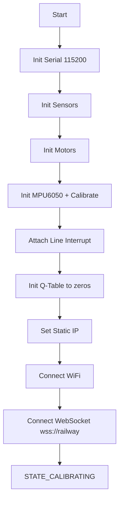
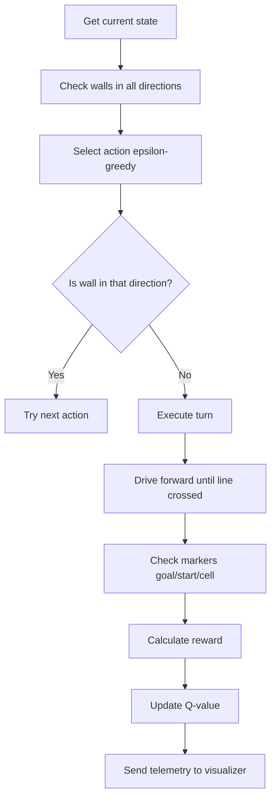
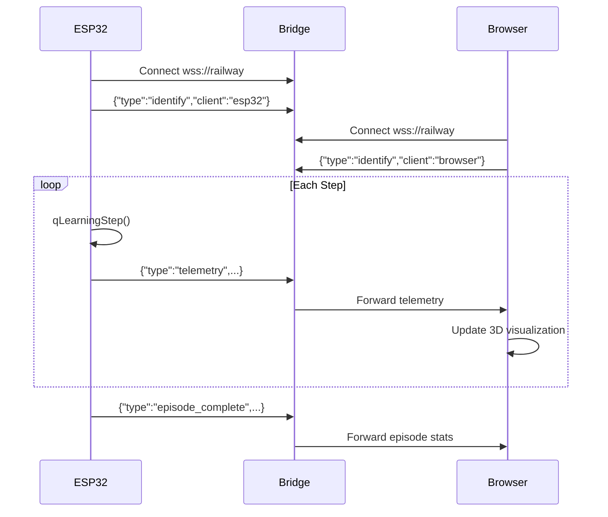

# Maze Solver Bot - Code Explanation

Complete line-by-line explanation of [`maze_solver.ino`](file:///c:/Users/Lenovo/Desktop/botvisualizer/esp32/maze_solver.ino)

---

## 📦 Libraries & Includes (Lines 11-14)

```cpp
#include <WiFi.h>            // ESP32 WiFi connectivity
#include <WebSocketsClient.h> // WebSocket client for connecting to bridge server
#include <Wire.h>            // I2C communication for MPU6050 sensor
#include <ArduinoJson.h>     // JSON parsing/creation for telemetry data
```

---

## ⚙️ Configuration (Lines 16-90)

### WiFi Credentials
```cpp
const char* WIFI_SSID = "POCO X7 Pro";   // Your phone hotspot name
const char* WIFI_PASSWORD = "12345678";   // Hotspot password
```

### Pin Definitions

| Component | Pins | Purpose |
|-----------|------|---------|
| **Ultrasonic Sensors** | TRIG: 14,18,16 / ECHO: 35,13,34 | Detect walls front/left/right |
| **Line Sensor** | Pin 4 | Detect floor markers (cells, start, goal) |
| **L298N Motors** | IN1-IN4: 19,21,22,23 / ENA,ENB: 25,26 | Control motor direction and speed |
| **MPU6050** | SDA: 32, SCL: 33 | Measure rotation (yaw) for turns |

### Speed & Thresholds
```cpp
#define WALL_THRESHOLD 5     // Wall detected if distance < 5cm
#define BASE_SPEED 150       // Forward driving speed (0-255)
#define TURN_SPEED 180       // Turning speed (higher for L298N voltage drop)
#define TURN_TOLERANCE 3     // Turn complete if within 3 degrees of target
```

### Q-Learning Parameters
```cpp
#define MAZE_SIZE 5          // 5x5 maze = 25 states
#define NUM_ACTIONS 4        // NORTH, EAST, SOUTH, WEST

float Q[25][4];              // Q-table: value for each state-action pair
float alpha = 0.3;           // Learning rate (how fast to update)
float gamma_rl = 0.9;        // Discount factor (importance of future rewards)
float epsilon = 0.5;         // Exploration rate (50% random actions initially)
```

---

## 🔧 Sensor Functions (Lines 197-237)

### `readDistance()` - Ultrasonic Measurement
```cpp
float readDistance(int trigPin, int echoPin) {
    digitalWrite(trigPin, LOW);      // Clear trigger
    delayMicroseconds(2);
    digitalWrite(trigPin, HIGH);     // Send 10µs pulse
    delayMicroseconds(10);
    digitalWrite(trigPin, LOW);
    
    long duration = pulseIn(echoPin, HIGH, 30000);  // Measure echo time
    
    if (duration == 0) return 999.0; // No echo = no wall
    
    return duration * 0.034 / 2.0;   // Convert to cm (speed of sound)
}
```

### Wall Detection
```cpp
bool isFrontWall() { return readFrontDistance() < WALL_THRESHOLD; }
bool isLeftWall()  { return readLeftDistance() < WALL_THRESHOLD; }
bool isRightWall() { return readRightDistance() < WALL_THRESHOLD; }
```

---

## 🏎️ Motor Control (Lines 239-337)

### `setMotorLeft()` - Control Left Motor
```cpp
if (speed > 0) {           // Forward
    digitalWrite(IN1, HIGH);
    digitalWrite(IN2, LOW);
    ledcWrite(ENA, speed);
} else if (speed < 0) {    // Backward
    digitalWrite(IN1, LOW);
    digitalWrite(IN2, HIGH);
    ledcWrite(ENA, -speed);
} else {                   // Stop
    digitalWrite(IN1, LOW);
    digitalWrite(IN2, LOW);
}
```

### `driveForwardWithCorrection()` - PID Straight Driving
```cpp
float error = targetHeading - currentYaw;  // How far off course?
int correction = KP * error + KI * integral + KD * derivative;

leftSpeed = BASE_SPEED + correction;   // If drifting right, speed up left
rightSpeed = BASE_SPEED - correction;  // If drifting right, slow down right
```

---

## 🧭 MPU6050 / Gyroscope (Lines 339-451)

### `initMPU6050()` - Calibration
```cpp
// Average 100 readings to find the offset (gyro drift when stationary)
for (int i = 0; i < 100; i++) {
    sum += readRawGyroZ();
    delay(10);
}
gyroZOffset = sum / 100.0;
```

### `updateYaw()` - Track Rotation
```cpp
float gyroZ = readRawGyroZ() - gyroZOffset;  // Remove drift
currentYaw += gyroZ * dt;                     // Integrate: degrees/sec * seconds
```

### `turnRight90()` - Turn with Timeout
```cpp
turnRightInPlace();                            // Start spinning
while (millis() - turnStart < 5000) {          // Max 5 seconds
    updateYaw();
    if (abs(targetYaw - currentYaw) < 3) break; // Within 3 degrees = done
}
stopMotors();
```

---

## 📍 Line Detection (Lines 453-464)

### `onLineCrossed()` - Interrupt Handler
```cpp
void IRAM_ATTR onLineCrossed() {     // IRAM_ATTR = fast interrupt code
    if (now - firstPulse > 500) {     // New line crossing (debounce)
        lineCount = 1;
    } else {
        lineCount++;                  // Multiple lines = marker
    }
    cellCrossed = true;               // Signal main loop
}
```

| lineCount | Meaning |
|-----------|---------|
| 1 | Normal cell boundary |
| 2 | START marker |
| 3+ | GOAL marker |

---

## 🌐 WebSocket Communication (Lines 466-495)

### `webSocketEvent()` - Handle Connection
```cpp
case WStype_CONNECTED:
    clientConnected = true;
    // Tell bridge server "I am the ESP32"
    doc["type"] = "identify";
    doc["client"] = "esp32";
    webSocket.sendTXT(json);
```

---

## 🚀 Setup & Main Loop (Lines 497-586)

### `setup()` - Initialization


### `loop()` - State Machine
```cpp
switch (robotState) {
    case STATE_CALIBRATING:  // Wait for boot button
        if (buttonPressed) robotState = STATE_EXPLORING;
        
    case STATE_EXPLORING:    // Run Q-learning steps
        qLearningStep();
        
    case STATE_AT_GOAL:      // Reached goal!
        sendEpisodeComplete();
        robotState = STATE_RETURNING;
        
    case STATE_RETURNING:    // Wait to be placed at start
        if (buttonPressed) resetEpisode();
}
```

---

## 🧠 Q-Learning Algorithm (Lines 588-695)

### `qLearningStep()` - One Step of Learning



### `selectAction()` - Epsilon-Greedy
```cpp
if (random(100) < epsilon * 100) {
    return random(4);           // Explore: random action
} else {
    return argmax(Q[state]);    // Exploit: best known action
}
```

### `updateQValue()` - Bellman Equation
```cpp
Q[s][a] += α * (reward + γ * max(Q[s'][a']) - Q[s][a])

// Where:
// α = 0.3 (learning rate)
// γ = 0.9 (discount factor)
// reward = +100 (goal), -1 (step), -10 (wall hit)
```

---

## 📡 Telemetry (Lines 735-766)

### `sendTelemetry()` - Send to Visualizer
```json
{
    "type": "telemetry",
    "position": { "x": 2, "y": 3 },
    "heading": 90,
    "walls": { "front": true, "left": false, "right": true },
    "episode": 5,
    "step": 12,
    "reward": -8,
    "isGoal": false
}
```

---

## 📊 Complete Flow Diagram


